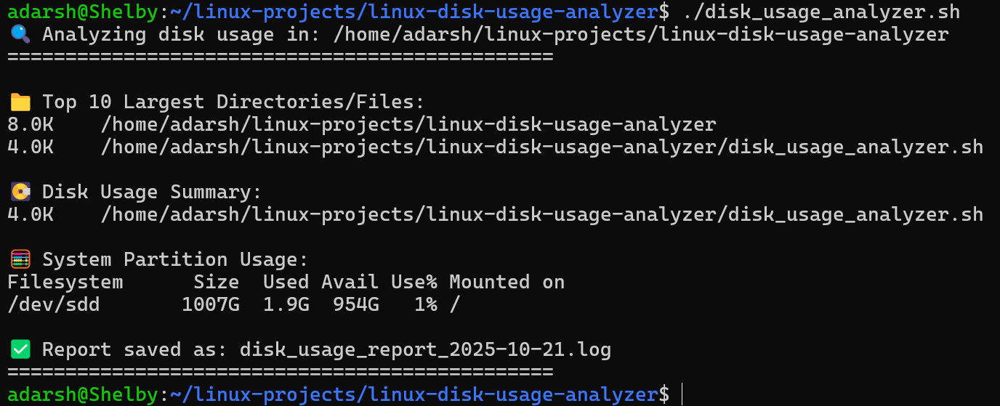

# 💽 Linux Disk Usage Analyzer

### 👨‍💻 Author

**Adarsh Shivan**<br>GitHub: [https://github.com/adarshshivan](https://github.com/adarshshivan)

---

## 📘 Overview
The Linux Disk Usage Analyzer is a Bash-based utility that helps users identify how storage space is being used on their system.
It lists the largest files and directories, shows total disk usage per folder, and provides a summary of system partitions.
This tool is lightweight, fast, and perfect for anyone learning Linux system administration or managing limited disk space.

---

## 🧰 Features
- Lists top 10 largest files and directories
- Displays per-folder usage summary
- Shows system partition usage (df -h)
- Automatically generates a detailed log file report
- Includes a safe demo mode for portfolio demonstrations
- Simple, portable, and runs on any Linux-based system

---

## ⚙️ Tools & Technologies Used
- 🐧 Linux / WSL (Ubuntu)
- 💻 Bash Scripting
- 📊 du, df, and sort commands
- 🧾 GitHub (for version control)
- ✍️ VS Code / Nano (for editing scripts)

---

## 🧩 How It Works
1. The script scans a target directory (default: current directory).
2. It uses the du command to find the top 10 largest files or folders.
3. It displays summarized disk usage in an easy-to-read format.
4. It captures system partition details using the df command.
5. It saves a complete report as disk_usage_report_<date>.log.

---

## ▶️ Usage Instructions

### 1️⃣ Make It Executable
```bash
chmod +x disk_usage_analyzer.sh
```
### 2️⃣ Run the Script
```bash
bash disk_usage_analyzer.sh
```

Or (if executable):

```bash
./disk_usage_analyzer.sh
```

---

### 📂 Example Output

▶️ After Running 



---

### 🎓 What I Learned

- Using du and df effectively for disk management
- Sorting and formatting terminal output
- Logging system reports dynamically
- Creating safe and demo-friendly Bash scripts
- Writing professional documentation for GitHub portfolios

---

### 🧠 Project Summary

The Linux Disk Usage Analyzer is a practical automation script built to help users monitor and manage their disk space efficiently.
It combines system administration skills, Bash scripting logic, and formatted reporting into one clean utility.
The inclusion of both real and safe simulated modes makes it ideal for both system maintenance and educational demonstrations.

This project demonstrates proficiency in:

Linux disk management commands

Shell scripting automation

Log file generation and output redirection
